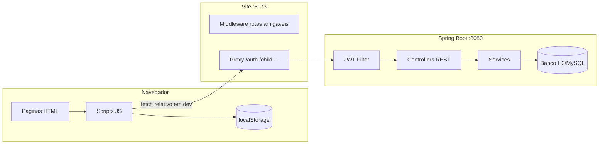
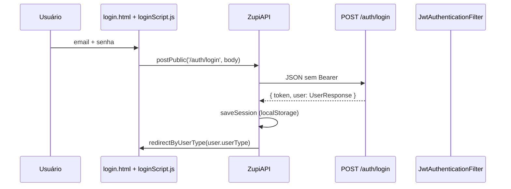

# Documentação completa — Projeto Zupi (TCC-DS)

Este documento descreve **como o sistema funciona de ponta a ponta**: arquitetura, rotas do frontend (Vite), comunicação com a API Spring Boot, papel de cada classe Java e de cada arquivo JavaScript.

---

## Índice

1. [Visão geral da arquitetura](#1-visão-geral-da-arquitetura)
2. [Como frontend e backend se comunicam](#2-como-frontend-e-backend-se-comunicam)
3. [Autenticação JWT (fluxo completo)](#3-autenticação-jwt-fluxo-completo)
4. [Rotas do frontend (Vite MPA)](#4-rotas-do-frontend-vite-mpa)
5. [Mapa: tela HTML → script JS → endpoint API](#5-mapa-tela-html--script-js--endpoint-api)
6. [Fluxos de navegação por tipo de usuário](#6-fluxos-de-navegação-por-tipo-de-usuário)
7. [Backend — controllers (API REST)](#7-backend--controllers-api-rest)
8. [Backend — services (regras de negócio)](#8-backend--services-regras-de-negócio)
9. [Backend — segurança](#9-backend--segurança)
10. [Backend — modelos (entidades JPA)](#10-backend--modelos-entidades-jpa)
11. [Backend — repositórios, DTOs e mappers](#11-backend--repositórios-dtos-e-mappers)
12. [Backend — exceções e tratamento global](#12-backend--exceções-e-tratamento-global)
13. [Frontend — scripts core (todos os HTML)](#13-frontend--scripts-core-todos-os-html)
14. [Frontend — cada arquivo JavaScript](#14-frontend--cada-arquivo-javascript)
15. [Frontend — páginas HTML por categoria](#15-frontend--páginas-html-por-categoria)
16. [localStorage e estado da sessão](#16-localstorage-e-estado-da-sessão)
17. [Como rodar e depurar](#17-como-rodar-e-depurar)

---

## 1. Visão geral da arquitetura

O repositório está dividido em dois projetos independentes que conversam apenas por **HTTP + JSON**:

| Camada | Pasta | Tecnologia | Responsabilidade |
|--------|-------|------------|------------------|
| **Frontend** | `zupi-frontend/` | Vite + HTML/CSS/JS (MPA) | Interface, navegação, guards, chamadas `fetch` |
| **Backend** | `src/main/java/.../zupibackend/` | Spring Boot 3 + JPA + Security | API REST, JWT, banco de dados, regras de negócio |

O backend **não serve páginas HTML**. Toda a UI vive em `zupi-frontend/*.html` e em `zupi-frontend/public/`.



---

## 2. Como frontend e backend se comunicam

### 2.1 Desenvolvimento (`npm run dev`)

1. O usuário acessa `http://localhost:5173/login`.
2. O **middleware do Vite** (`vite.config.js` → `htmlRoutesPlugin`) reescreve `/login` para `/login.html`.
3. Cada página carrega `api.js`, que define o objeto global **`ZupiAPI`**.
4. Em dev/preview (portas **5173** ou **4173**), `ZupiAPI` usa **base URL vazia** (`''`), ou seja, requisições como `fetch('/auth/login')` vão para o mesmo host do Vite.
5. O **proxy do Vite** encaminha prefixos para `http://localhost:8080`:

| Prefixo no proxy | Destino na API |
|------------------|----------------|
| `/auth` | Autenticação e usuários |
| `/child` | Crianças, relatórios, jogos |
| `/contact` | Formulário de contato |
| `/skillAreas` | Áreas de habilidade |
| `/content` | Conteúdo estático (feed, dicas, etc.) |
| `/quiz` | Questionário de onboarding |
| `/support` | Tickets de ajuda |
| `^/\d+/events` | Agenda (`/{userId}/events`) |

Isso evita problemas de **CORS** durante o desenvolvimento.

### 2.2 Produção

- `npm run build` gera `zupi-frontend/dist/`.
- O frontend é servido por Nginx/CDN; a API em outro host.
- `window.ZUPI_API_BASE` (injetado no build) ou fallback em `api.js` aponta para `http://localhost:8080` (ou URL de produção).
- Todas as requisições autenticadas enviam:

```http
Authorization: Bearer <token>
Content-Type: application/json
```

### 2.3 Cliente HTTP central: `ZupiAPI` (`public/js/api.js`)

| Função | Uso |
|--------|-----|
| `saveSession(data)` | Grava token e dados do usuário no `localStorage` após login |
| `getToken()` / `getUser()` | Lê sessão local |
| `isAuthenticated()` | Verifica token + `userId` válido |
| `requireAuth()` | Redireciona para `/login` se não autenticado |
| `requireRole(...roles)` | Exige tipo de usuário específico |
| `buildUrl(path)` | Monta URL final (base + path) |
| `request(url, options)` | `fetch` com Bearer; em 401/403 limpa sessão e vai para login |
| `fetchJson(url)` | GET/POST que retorna JSON ou `null` |
| `postPublic(url, body)` | POST **sem** token e **sem** redirect em 401 (login/cadastro) |
| `fetchMe()` | `GET /auth/me` |
| `fetchMyChildren()` | `GET /child/me` → array de crianças |
| `redirectByUserType(type)` | Envia para dashboard correto após login |

---

## 3. Autenticação JWT (fluxo completo)

### 3.1 Login do responsável (e outros perfis de `User`)



**Backend (`UserService.login`):**

1. Busca usuário por e-mail.
2. Valida senha com `BCryptPasswordEncoder`.
3. Gera JWT via `JwtUtil.generateToken(email, userId, userType)`.
4. Retorna `LoginResponse(token, UserResponse)`.

**Frontend (`loginScript.js`):**

1. Chama `ZupiAPI.postPublic('/auth/login', { email, password })`.
2. Em sucesso: `ZupiAPI.saveSession(data)` e `redirectByUserType`.

### 3.2 Login da criança

- Endpoint: `POST /auth/child/login` (`ChildAuthController`).
- Body: `ChildLoginDTO` (e-mail e senha gerados no cadastro da criança).
- `ChildService.login` valida credenciais na entidade `Child`, gera JWT com `userType` `CRIANCA` ou `ALUNO_CREDENCIADO`.
- Resposta: `ChildLoginResponse(token, ChildResponse)`.
- No front, o fluxo infantil dedicado ainda é limitado; o fluxo principal do responsável seleciona a criança em `/selecao-perfil` e grava `activeChildId`.

### 3.3 Validação em cada requisição

1. `JwtAuthenticationFilter` lê `Authorization: Bearer ...`.
2. `JwtUtil.validateToken` verifica assinatura e expiração.
3. E-mail do token → `CustomUserDetailsService.loadUserByUsername`.
4. Cria `UserDetailsImpl` com `ROLE_<UserType>` (ex.: `ROLE_RESPONSAVEL`).
5. Preenche `SecurityContextHolder` → controllers usam `SecurityUtils.getCurrentUserId()`.

### 3.4 Controle de acesso a recursos

`AccessControlService.ensureCanAccessChild(childId)`:

- **ADMIN**: acesso total.
- **CRIANCA / ALUNO_CREDENCIADO**: só o próprio `childId`.
- **RESPONSAVEL**: só filhos cujo `responsible.id` é o usuário logado.

`SecurityUtils.requireUserId(userId)` protege rotas como `GET /auth/{id}` e `GET /{userId}/events`.

---

## 4. Rotas do frontend (Vite MPA)

### 4.1 Geração automática de rotas

Para cada `arquivo.html` na raiz de `zupi-frontend/`, o Vite registra:

- Rota: `/nome-do-arquivo` (sem `.html`)
- Arquivo físico: `/nome-do-arquivo.html`
- Exceção: `index.html` → `/`

### 4.2 Aliases manuais (`ROUTE_ALIASES` em `vite.config.js`)

| URL amigável | Arquivo real |
|--------------|--------------|
| `/` | `index.html` |
| `/dashboard` | `dashboard-pais.html` |
| `/contatos` | `contato.html` |
| `/perfil` | `perfil-criancas.html` |
| `/jogoMath` | `JogoMath.html` |
| `/JogoLigarObjetos` | `jogo-ligar-objetos.html` |

### 4.3 Constantes em `routes.js` (`ZupiRoutes`)

Centraliza paths usados nos redirects do `api.js` e em scripts (ex.: `ZupiRoutes.selecaoPerfil` → `/selecao-perfil`).

### 4.4 Proteção de páginas: `auth-guard.js`

Executado em `DOMContentLoaded` em quase todos os HTML (via `inject-core-scripts.mjs`):

| Tipo | Comportamento |
|------|----------------|
| **Públicas** | `/`, `/login`, `/cadastro`, `/contato`, planos, esqueci-senha, etc. |
| **Jogos** (`/jogo*`) | Públicas no guard; `game-guard.js` exige login + `activeChildId` |
| **Área do responsável** | Exige auth; se `userType` não for `RESPONSAVEL` nem `ADMIN`, redireciona |
| **Contexto infantil** | `/dashboard-crianca`, `/menuJogos`, etc.: exige `activeChildId` no `localStorage` |

### 4.5 Injeção de scripts core

`zupi-frontend/scripts/inject-core-scripts.mjs` adiciona em cada HTML:

```html
<script src="/js/routes.js"></script>
<script src="/js/api.js"></script>
<script src="/js/auth-guard.js"></script>
```

Nos jogos, também adiciona `game-guard.js` e `game-score.js`.

---

## 5. Mapa: tela HTML → script JS → endpoint API

### 5.1 Autenticação e conta

| Tela | Rota | Script(s) | Endpoints API |
|------|------|-----------|---------------|
| `login.html` | `/login` | `loginScript.js` | `POST /auth/login` |
| `cadastro.html` | `/cadastro` | `cadastroScript.js` | `POST /auth/register`, `POST /auth/login` |
| `esqueci-senha.html` | `/esqueci-senha` | `password-reset.js` | `POST /auth/forgot-password` |
| `redefinir-senha.html` | `/redefinir-senha?token=` | `password-reset.js` | `POST /auth/reset-password` |
| `configuracoes.html` | `/configuracoes` | `config.js` | `GET /auth/me`, `PUT /auth/{id}`, `PATCH .../email`, `PATCH .../password`, `PATCH .../two-factor` |

### 5.2 Responsável — filhos e dashboard

| Tela | Rota | Script(s) | Endpoints API |
|------|------|-----------|---------------|
| `selecao-perfil.html` | `/selecao-perfil` | `selecaoPerfilScript.js` | `GET /child/me` |
| `dashboard-pais.html` | `/dashboard` | `dashboardScript.js` | `GET /auth/me`, `GET /child/me`, `POST /child` |
| `cadastro-dependentes.html` | `/cadastro-dependentes` | `cadastroDependenteScript.js` | `POST /child`, `GET /child/me` |
| `onboarding-crianca.html` | `/onboarding-crianca` | inline | `POST /quiz/child/{id}`, `POST /quiz/complete`, `GET /child/details/{id}` |
| `perfil-criancas.html` | `/perfil` | `perfilPageScript.js` | `GET /child/details/{id}` |
| `perfil-responsavel.html` | `/perfil-responsavel` | (estático / futuro) | — |
| `selecao-relatorios.html` | `/selecao-relatorios` | `selecaoRelatoriosScript.js` | `GET /child/me` |
| `relatorios.html` | `/relatorios` | `relatoriosPageScript.js` | `GET /child/details/{id}`, `GET .../reports/avg`, `GET .../games/progress`, `GET .../games/sessions`, `GET /skillAreas`, `POST .../reports` |
| `agenda.html` | `/agenda` | `agendaScript.js` | `GET /{userId}/events`, `POST /{userId}/events`, `GET /child/me`, `GET /skillAreas` |
| `ajuda.html` | `/ajuda` | `ajudaScript.js` | `POST /support/ticket` |

### 5.3 Área infantil (criança ativa)

| Tela | Rota | Script(s) | Endpoints API |
|------|------|-----------|---------------|
| `dashboard-crianca.html` | `/dashboard-crianca` | `child-nav.js`, `dashboardCriancaScript.js` | `GET /child/details/{id}`, `GET .../games/progress`, `GET .../games/sessions` |
| `menuJogos.html` | `/menuJogos` | `game-guard.js` | — (só links) |
| `jogo*.html` | `/jogoMemoria`, etc. | jogo específico + `game-score.js` | `POST /child/{id}/games/session` (ao terminar, se o jogo chamar `GameScore.submit`) |
| `atividades-interativas.html` | `/atividades-interativas` | `content-pages.js` | `GET /content/atividades/{childId}` |
| `biblioteca.html` | `/biblioteca` | `content-pages.js` / estático | — |
| `dicas-inclusao.html` | `/dicas-inclusao` | `content-pages.js` | `GET /content/dicas-inclusao` |
| `feed.html` | `/feed` | `content-pages.js` | `GET /content/feed` |
| `guia-casa.html` | `/guia-casa` | `content-pages.js` | `GET /content/guia-casa/{childId}` |
| `desafios-semanais.html` | `/desafios-semanais` | `content-pages.js` | `GET /content/desafios-semanais` |
| `perfil-crianca.html` | `/perfil-crianca` | `child-nav.js` | — |

### 5.4 Públicas / marketing

| Tela | Rota | API |
|------|------|-----|
| `index.html` | `/` | — |
| `contato.html` | `/contato`, `/contatos` | `POST /contact` |
| `planos.html`, `sobre.html`, etc. | várias | — |
| `dashboard-escola.html` | `/dashboard-escola` | UI mock (integração futura) |
| `dashboard-docente.html` | `/dashboard-docente` | UI mock |
| `dashboard-admin.html` | `/dashboard-admin` | `GET /auth` (lista usuários — só ADMIN) |

### 5.5 API sem tela dedicada (ainda)

| Endpoint | Uso previsto |
|----------|----------------|
| `GET /auth/child/login` | Login direto da criança (tela específica futura) |
| `GET /` | Info da API (`ApiInfoController`) |
| Swagger `/swagger-ui` | Documentação OpenAPI |

---

## 6. Fluxos de navegação por tipo de usuário

### 6.1 RESPONSAVEL (fluxo principal)

```mermaid
flowchart TD
  A[Login] --> B[/selecao-perfil]
  B --> C[Card Responsável]
  B --> D[Card Criança]
  B --> E[Card + Cadastrar]
  C --> F[/dashboard]
  D --> G[/dashboard-crianca]
  E --> H[/cadastro-dependentes]
  H --> I[/onboarding-crianca]
  F --> J[/relatorios / agenda / configuracoes]
  G --> K[/menuJogos → jogos]
```

**Estado no navegador:**

- Após login: `authToken`, `userId`, `userType`, `userName`, `userEmail`.
- Ao escolher criança: `activeChildId`, `activeProfile=CRIANCA`.
- Ao escolher responsável: remove `activeChildId`, `activeProfile=RESPONSAVEL`.

### 6.2 Redirecionamento pós-login (`redirectByUserType`)

| `userType` | Destino |
|------------|---------|
| `RESPONSAVEL` | `/selecao-perfil` |
| `ESCOLA` | `/dashboard-escola` |
| `DOCENTE` | `/dashboard-docente` |
| `ADMIN` | `/dashboard-admin` |
| `CRIANCA` / `ALUNO_CREDENCIADO` | `/dashboard-crianca` |
| outro | `/dashboard` |

---

## 7. Backend — controllers (API REST)

Cada controller expõe endpoints REST. Todos os não listados em `SecurityConfig` como `permitAll` exigem JWT válido.

### 7.1 `UserController` — base `/auth`

| Método | Path | Função | Quem usa (front) |
|--------|------|--------|------------------|
| GET | `/auth` | Lista todos usuários | Admin (futuro) |
| GET | `/auth/me` | Usuário autenticado | `fetchMe`, dashboard, config |
| GET | `/auth/{id}` | Usuário por ID | — |
| POST | `/auth/register` | Cadastro | `cadastroScript.js` |
| POST | `/auth/login` | Login | `loginScript.js` |
| POST | `/auth/forgot-password` | Solicita reset | `password-reset.js` |
| POST | `/auth/reset-password` | Nova senha com token | `password-reset.js` |
| PUT | `/auth/{id}` | Atualiza dados | `config.js` |
| PATCH | `/auth/{id}/email` | Altera e-mail | `config.js` |
| PATCH | `/auth/{id}/password` | Altera senha | `config.js` |
| PATCH | `/auth/{id}/two-factor` | 2FA | `config.js` |

**Classe:** recebe HTTP, delega a `UserService` e `PasswordResetService`, retorna DTOs (`UserResponse`, `LoginResponse`).

### 7.2 `ChildController` — base `/child`

| Método | Path | Função | Front |
|--------|------|--------|-------|
| GET | `/child/me` | Filhos do responsável logado | `fetchMyChildren`, seleção perfil |
| GET | `/child/{userId}` | Filhos por ID do responsável | — |
| GET | `/child/details/{id}` | Detalhe de uma criança | perfil, relatórios, dashboard criança |
| POST | `/child` | Cadastra criança + credenciais | dashboard, cadastro dependente |
| PUT | `/child/{id}` | Atualiza criança | — |
| DELETE | `/child/{id}` | Remove criança | — |

### 7.3 `ChildAuthController` — base `/auth/child`

| Método | Path | Função |
|--------|------|--------|
| POST | `/auth/child/login` | Login com e-mail/senha da criança |

### 7.4 `ChildReportController` — base `/child/{childId}/reports`

| Método | Path | Função | Front |
|--------|------|--------|-------|
| GET | `/child/{childId}/reports` | Lista relatórios | — |
| GET | `/child/{childId}/reports/lasted` | Últimos 3 dias | — |
| GET | `/child/{childId}/reports/avg` | Médias por área | `relatoriosPageScript.js` (gráficos) |
| POST | `/child/{childId}/reports` | Cria relatório manual | modal em relatórios |
| PUT | `/child/{childId}/reports/{id}` | Atualiza relatório | — |

### 7.5 `GameSessionController` — base `/child/{childId}/games`

| Método | Path | Função | Front |
|--------|------|--------|-------|
| POST | `/child/{childId}/games/session` | Registra partida | `game-score.js` |
| GET | `/child/{childId}/games/sessions` | Histórico | dashboard criança, relatórios |
| GET | `/child/{childId}/games/progress` | Resumo de progresso | dashboard criança, relatórios |

### 7.6 `EventController` — base `/{userId}/events`

| Método | Path | Função | Front |
|--------|------|--------|-------|
| GET | `/{userId}/events` | Lista eventos do usuário | `agendaScript.js` |
| POST | `/{userId}/events` | Cria evento | agenda |
| PUT | `/{userId}/events/{id}` | Atualiza | — |
| DELETE | `/{userId}/events/{id}` | Remove | — |

### 7.7 `QuizController` — base `/quiz`

| Método | Path | Função | Front |
|--------|------|--------|-------|
| GET | `/quiz/child/{childId}` | Último quiz | — |
| POST | `/quiz/child/{childId}` | Cria quiz inicial | `onboarding-crianca.html` |
| POST | `/quiz/complete` | Envia respostas | onboarding |

### 7.8 `ContentController` — base `/content` (público)

Retorna listas **mock** em memória (não persiste no banco). Usado por `content-pages.js`.

| GET | Path |
|-----|------|
| `/content/dicas-inclusao` | |
| `/content/feed` | |
| `/content/atividades/{childId}` | |
| `/content/guia-casa/{childId}` | |
| `/content/desafios-semanais` | |

### 7.9 Outros controllers

| Controller | Base | Resumo |
|------------|------|--------|
| `ContactController` | `/contact` | `POST` mensagem de contato (público) |
| `SkillAreaController` | `/skillAreas` | Áreas de habilidade (GET público; POST/PUT admin) |
| `SupportController` | `/support` | Tickets de suporte (`ajudaScript.js`) |
| `ApiInfoController` | `GET /` | JSON com nome/versão da API |

---

## 8. Backend — services (regras de negócio)

| Service | Responsabilidade principal |
|---------|---------------------------|
| **`UserService`** | CRUD usuários, login, registro, atualização e-mail/senha/2FA; usa `JwtUtil`, `PasswordEncoder`, `AccessControlService` |
| **`PasswordResetService`** | Gera token de reset, envia e-mail (`EmailService`), valida token em `reset-password` |
| **`EmailService`** | Envio de e-mails (SMTP configurado em `application.properties`) |
| **`ChildService`** | CRUD crianças, login infantil, geração de e-mail/senha aleatórios no cadastro, validação CPF/idade, `findForCurrentResponsible()` |
| **`ChildReportService`** | Relatórios pedagógicos, médias por área, últimos 3 dias |
| **`GameSessionService`** | Persiste sessão de jogo, associa `skillArea`, dispara `AutoReportService` |
| **`AutoReportService`** | Atualiza relatórios automaticamente com base em jogos |
| **`EventService`** | CRUD eventos da agenda vinculados ao `userId` |
| **`QuizService`** | Cria e completa questionário de onboarding; gera resumo |
| **`SupportService`** | Persiste e lista tickets de ajuda |

**Padrão:** Controller → Service → Repository → Entidade JPA. Services aplicam validações e chamam `AccessControlService` antes de acessar dados de terceiros.

---

## 9. Backend — segurança

### 9.1 `SecurityConfig`

- **Stateless** (sem sessão HTTP).
- **CSRF desabilitado** (API REST + JWT).
- **CORS** para origens em `app.cors.allowed-origins` (Vite 5173/4173).
- **Rotas públicas:** login, register, reset, child login, contact, swagger, `GET /`, `skillAreas`, `content/**`.
- **`GET /auth`:** apenas `ROLE_ADMIN`.
- **Demais rotas:** autenticadas.

### 9.2 `JwtAuthenticationFilter`

Filtro que roda **antes** de cada request: extrai Bearer, valida JWT, carrega usuário no contexto Spring Security.

### 9.3 `JwtUtil`

- Assina com HMAC-SHA256 (`jwt.secret`).
- Claims: `sub` (e-mail), `userId`, `userType`.
- Expiração: `jwt.expiration-ms` (padrão 24h).

### 9.4 `CustomUserDetailsService`

- Para usuários normais: carrega `User` do banco → `UserDetailsImpl.build(user)`.
- Para login infantil: pode carregar `Child` → `UserDetailsImpl.buildFromChild(child)` com role `CRIANCA` ou `ALUNO_CREDENCIADO`.

### 9.5 `UserDetailsImpl`

Implementa `UserDetails` do Spring: id, e-mail, senha, authorities (`ROLE_*`), flag `active`.

### 9.6 `SecurityUtils`

Helpers estáticos: usuário atual, `getCurrentUserId()`, `hasRole`, `isChildAccount()`, `requireUserId`.

### 9.7 `AccessControlService`

Regra de **ownership** para crianças e recursos derivados (`childId` em jogos/relatórios).

### 9.8 `JsonAuthenticationEntryPoint` / `JsonAccessDeniedHandler`

Retornam **JSON** em 401/403 em vez de redirect HTML (adequado para SPA/MPA com API).

---

## 10. Backend — modelos (entidades JPA)

| Entidade | Tabela | Descrição |
|----------|--------|-----------|
| **`User`** | `usuarios` | Responsável, escola, docente, admin; `userType`, plano, filhos (`OneToMany` → `Child`), eventos |
| **`Child`** | `children` | Criança; CPF, idade, turma, condição; `responsible` (ManyToOne → User); credenciais `childLoginEmail` / `childPasswordHash` |
| **`Event`** | — | Compromissos da agenda; ligado a `User` e opcionalmente `Child` |
| **`GameSession`** | — | Partida de jogo: `gameId`, score, duração, `playedAt`, `Child`, `SkillArea` |
| **`ChildReport`** | — | Relatório pedagógico da criança |
| **`ChildReportScore`** | — | Notas por área de habilidade dentro de um relatório |
| **`SkillArea`** | — | Áreas (memória, matemática, etc.) |
| **`School`** | — | Escola (vínculo futuro) |
| **`Teacher`** | — | Docente |
| **`PasswordResetToken`** | — | Token único para reset de senha |
| **`Quiz`** (via repository) | — | Respostas do onboarding |

**Enum `UserType`:** `RESPONSAVEL`, `CRIANCA`, `ESCOLA`, `DOCENTE`, `ALUNO_CREDENCIADO`, `ADMIN`.

---

## 11. Backend — repositórios, DTOs e mappers

### 11.1 Repositories (Spring Data JPA)

| Repository | Entidade |
|------------|----------|
| `UserRepository` | `User` |
| `ChildRepository` | `Child` |
| `EventRepository` | `Event` |
| `GameSessionRepository` | `GameSession` |
| `ChildReportRepository` | `ChildReport` |
| `ChildReportScoreRepository` | `ChildReportScore` |
| `SkillAreaRepository` | `SkillArea` |
| `SchoolRepository` | `School` |
| `QuizRepository` | Quiz |
| `PasswordResetTokenRepository` | `PasswordResetToken` |
| `SupportTicketRepository` | Tickets |

### 11.2 DTOs (entrada/saída HTTP)

Exemplos:

- **Entrada:** `LoginDTO`, `UserRequest`, `ChildRequest`, `EventRequest`, `GameSessionRequest`, `ChildReportRequest`, `QuizAnswerRequest`, `ContactRequest`.
- **Saída:** `UserResponse`, `ChildResponse`, `LoginResponse`, `ChildLoginResponse`, `EventResponse`, `ChildReportResponse`, `QuizResponse`.

### 11.3 Mappers

Convertem entidade JPA ↔ DTO (ex.: `UserMapper`, `ChildMapper`, `ChildReportMapper`, `SkillAreaMapper`) — mantêm controllers finos.

---

## 12. Backend — exceções e tratamento global

| Exceção | HTTP | Quando |
|---------|------|--------|
| `BusinessException` | 400 | Regra de negócio (idade inválida, CPF, etc.) |
| `ResourceNotFoundException` | 404 | Entidade não encontrada |
| `DataBaseExceptions` | 400 | Violação de integridade |
| `ResponseStatusException` | variável | Forbidden, conflict, etc. |

**`GlobalExceptionHandler`:** converte exceções em `ProblemDetail` JSON (RFC 7807).

---

## 13. Frontend — scripts core (todos os HTML)

| Arquivo | Papel |
|---------|-------|
| **`routes.js`** | Objeto `ZupiRoutes` com paths canônicos |
| **`api.js`** | Cliente HTTP + sessão (`ZupiAPI`) |
| **`auth-guard.js`** | Proteção global de rotas (`ZupiAuthGuard`) |
| **`main.js`** | Tooltips Bootstrap, logout `[data-action="logout"]`, swipe sidebar mobile |
| **`theme.js`** | Tema claro/escuro (`ZupiTheme`) onde carregado |
| **`game-guard.js`** | Em jogos: exige login + `activeChildId` |
| **`game-score.js`** | `GameScore.submit()` → `POST .../games/session` |

---

## 14. Frontend — cada arquivo JavaScript

### 14.1 Núcleo e navegação

| Arquivo | O que faz |
|---------|-----------|
| **`api.js`** | Módulo IIFE `ZupiAPI`: base URL, JWT, fetch, login/logout, redirects |
| **`routes.js`** | Constantes de rotas amigáveis |
| **`auth-guard.js`** | Lista páginas públicas vs protegidas; redireciona não autenticados; valida área responsável e contexto infantil |
| **`main.js`** | Inicialização UI global (tooltips, popovers, logout, highlight nav, offcanvas swipe) |
| **`page-nav.js`** | Ajustes de navbar em páginas públicas autenticadas |
| **`child-nav.js`** | Menu lateral infantil: resolve `childId` da URL ou `localStorage`, reescreve links com `?childId=`, marca item ativo |
| **`theme.js`** | Preferência de tema no `localStorage` |

### 14.2 Autenticação e conta

| Arquivo | O que faz |
|---------|-----------|
| **`loginScript.js`** | Submit do formulário → `postPublic('/auth/login')` → `saveSession` → redirect |
| **`cadastroScript.js`** | Valida formulário → `postPublic('/auth/register')` → login automático → redirect |
| **`password-reset.js`** | Formulários esqueci/redefinir senha com `fetch` para `/auth/forgot-password` e `/auth/reset-password` |
| **`config.js`** | Carrega `/auth/me`; salva nome, e-mail, senha, 2FA via PATCH/PUT |

### 14.3 Responsável — perfis e dashboard

| Arquivo | O que faz |
|---------|-----------|
| **`selecaoPerfilScript.js`** | Cards Netflix: responsável, crianças (`/child/me`), adicionar; seta `activeChildId` |
| **`selecaoRelatoriosScript.js`** | Lista crianças para escolher qual ver relatório |
| **`dashboardScript.js`** | Dashboard pais (`/dashboard`): `fetchMe`, lista filhos, modal cadastro rápido `POST /child` |
| **`dashboardResponsavelPF.js`** | Variante PF do dashboard (mesma lógica de API) |
| **`cadastroDependenteScript.js`** | Formulário completo de dependente → `POST /child` → onboarding |
| **`perfilPageScript.js`** | Perfil da criança (`/perfil?childId=`) via `GET /child/details/{id}` |
| **`agendaScript.js`** | Lista/cria eventos `/{userId}/events`, popula selects com filhos e skill areas |
| **`relatoriosPageScript.js`** | Chart.js: médias, sessões, progresso; cria relatório manual |
| **`ajudaScript.js`** | Envia ticket `POST /support/ticket` |

### 14.4 Área infantil e conteúdo

| Arquivo | O que faz |
|---------|-----------|
| **`dashboardCriancaScript.js`** | Métricas no dashboard da criança (tempo, jogos, progresso) |
| **`content-pages.js`** | Objeto `ContentPages`: busca feed, dicas, atividades, guia, desafios da API `/content` |
| **`game-guard.js`** | Bloqueia jogos sem sessão/criança ativa |
| **`game-score.js`** | Envia pontuação ao backend após partida |

### 14.5 Jogos (lógica de cada tela)

Cada jogo tem script próprio (regras visuais e pontuação local). Exemplos:

| Arquivo | Jogo |
|---------|------|
| `jogoMemoria.js` | Jogo da memória |
| `jogomathscript.js` | Matemática (`JogoMath.html`) |
| `jogo-cores-formas.js` | Cores e formas |
| `jogo-ligar-objetos.js` | Ligar objetos |
| `sky-engine.js`, `zupi-sky.js` | Efeitos visuais / céu animado em jogos |

**Integração com API:** quando o jogo chama `GameScore.submit(gameId, score, maxScore, durationSeconds, skillAreaId)`, os dados vão para `GameSessionService`, que pode atualizar relatórios via `AutoReportService`.

---

## 15. Frontend — páginas HTML por categoria

### 15.1 Autenticação / marketing

`index.html`, `login.html`, `cadastro.html`, `esqueci-senha.html`, `redefinir-senha.html`, `sobre.html`, `planos.html`, `plano-*.html`, `contato.html`, `videos.html`, `zupi.html`, `erro.html`.

### 15.2 Responsável autenticado

`selecao-perfil.html`, `dashboard-pais.html` (rota `/dashboard`), `cadastro-dependentes.html`, `onboarding-crianca.html`, `perfil-criancas.html` (rota `/perfil`), `perfil-responsavel.html`, `selecao-relatorios.html`, `relatorios.html`, `agenda.html`, `configuracoes.html`, `ajuda.html`, `pagamento.html`, `recompensas.html`.

### 15.3 Criança (contexto `activeChildId`)

`dashboard-crianca.html`, `menuJogos.html`, `perfil-crianca.html`, `atividades-interativas.html`, `biblioteca.html`, `dicas-inclusao.html`, `feed.html`, `guia-casa.html`, `desafios-semanais.html`, mais de 15 páginas `jogo*.html`.

### 15.4 Outros perfis (UI preparada)

`dashboard-escola.html`, `dashboard-docente.html`, `dashboard-admin.html` — majoritariamente estáticos; integração completa com API é evolução futura.

---

## 16. localStorage e estado da sessão

| Chave | Definida quando | Uso |
|-------|-----------------|-----|
| `authToken` | Login | Header `Authorization` |
| `userId` | Login | Chamadas `/auth/me`, eventos |
| `userType` | Login | Redirects e `auth-guard` |
| `userName`, `userEmail` | Login | Exibição na UI |
| `activeChildId` | Seleção de perfil criança | Jogos, dashboard criança, relatórios |
| `activeProfile` | Seleção perfil | `RESPONSAVEL` ou `CRIANCA` |
| `childId` | Perfil/relatórios | Legado; sincronizado com `activeChildId` |

`ZupiAPI.clearSession()` / `logout()` remove todas essas chaves.

---

## 17. Como rodar e depurar

```bash
# API
.\mvnw.cmd spring-boot:run

# Frontend
cd zupi-frontend
npm install
npm run dev
```

**Checklist de verificação:**

1. Login em `/login` → Network deve mostrar `POST /auth/login` em **localhost:5173** (proxy), status 200.
2. `/selecao-perfil` → `GET /child/me` com Bearer.
3. Escolher criança → `activeChildId` no Application → Local Storage.
4. Jogo → ao finalizar, opcionalmente `POST /child/{id}/games/session`.

**Documentos relacionados:**

- [arquitetura.md](./arquitetura.md) — resumo e comandos
- [zupi-frontend/README.md](../zupi-frontend/README.md) — checklist pós-login

---

*Documento gerado para o TCC-DS — Zupi API + Frontend Vite. Atualize este arquivo quando novos endpoints ou telas forem adicionados.*
